# User Manual - POLTRANS EXAM
## Sistem CAT (Computer Assisted Test) Politeknik Transportasi SDP Palembang

**Versi:** 1.0  
**Diperbarui:** Januari 2026

---

## Daftar Isi

1. [Pendahuluan](#1-pendahuluan)
2. [Login ke Sistem](#2-login-ke-sistem)
3. [Super Admin](#3-super-admin)
4. [Admin Prodi](#4-admin-prodi)
5. [Dosen](#5-dosen)
6. [Mahasiswa](#6-mahasiswa)
7. [Pengawas](#7-pengawas)
8. [FAQ (Pertanyaan yang Sering Diajukan)](#8-faq)

---

## 1. Pendahuluan

POLTRANS EXAM adalah sistem Computer Assisted Test (CAT) yang dirancang untuk Politeknik Transportasi SDP Palembang. Sistem ini menyediakan platform ujian online yang aman dan efisien untuk seluruh civitas akademika.

### Fitur Utama:
- **Manajemen Ujian**: Pembuatan, penjadwalan, dan monitoring ujian
- **Keamanan**: Integrasi dengan Safe Exam Browser (SEB)
- **Multi-Role**: Mendukung berbagai peran pengguna
- **Rekapitulasi**: Laporan nilai dan kehadiran otomatis
- **Import/Export**: Dukungan format Excel (XLSX)

### Peran Pengguna:
| Peran | Akses |
|-------|-------|
| Super Admin | Semua data, prodi, user |
| Admin Prodi | Data per-prodi |
| Dosen | Pembuatan soal & koreksi |
| Mahasiswa | Mengikuti ujian |
| Pengawas | Monitoring & kehadiran |

---

## 2. Login ke Sistem

### 2.1 Mengakses Halaman Login

Buka browser dan akses URL aplikasi POLTRANS EXAM.

### 2.2 Langkah Login

1. **Pilih Tahun Akademik** - Pilih tahun akademik yang sesuai dari dropdown
2. **Masukkan NIP/NIM** - Isikan nomor identitas Anda
3. **Masukkan Password** - Isikan password Anda
4. **Klik "Masuk"** - Untuk masuk ke sistem

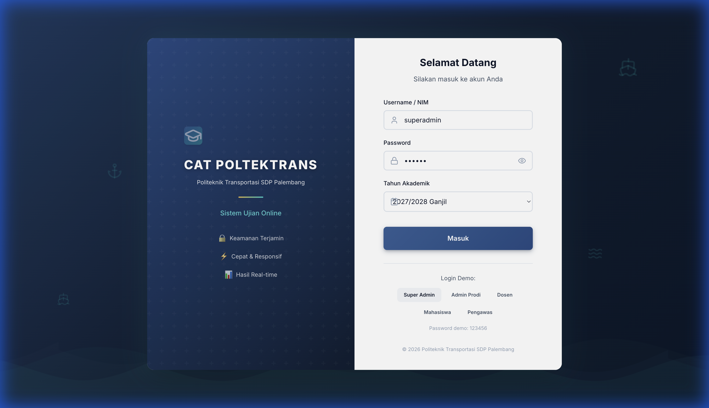

> **Demo Login**: Untuk testing, tersedia tombol demo login untuk setiap role (Super Admin, Admin, Dosen, Mahasiswa, Pengawas).

---

## 3. Super Admin

Super Admin memiliki akses penuh ke seluruh sistem.

### 3.1 Dashboard

Setelah login, Super Admin akan melihat dashboard dengan statistik sistem.

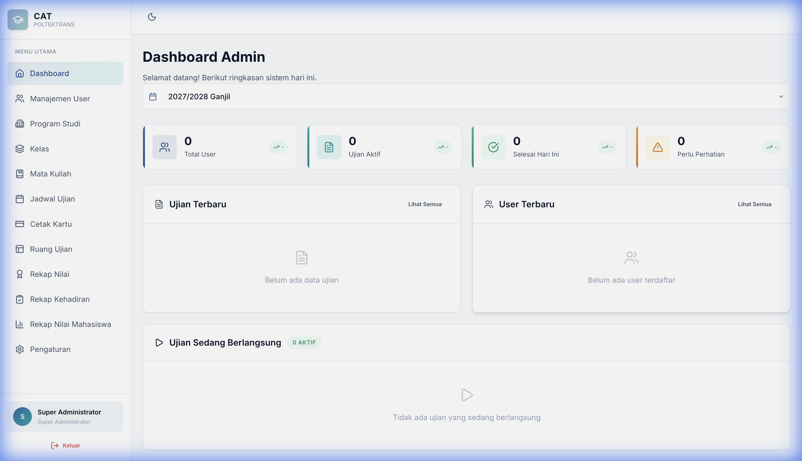

**Statistik yang ditampilkan:**
- Total pengguna aktif
- Jumlah prodi
- Ujian terjadwal
- Ujian berlangsung

### 3.2 Manajemen User

Menu untuk mengelola semua pengguna sistem.

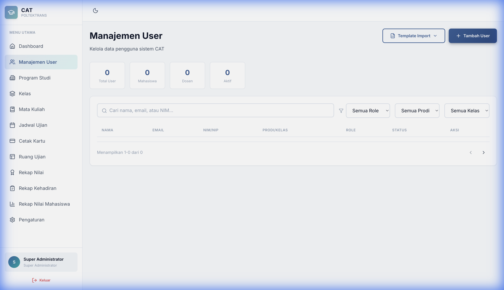

**Fitur:**
- **Tambah User**: Klik tombol "+ Tambah" untuk menambah user baru
- **Import User**: Import data user dari file Excel (.xlsx)
- **Export User**: Export data user ke file Excel
- **Template Import**: Unduh template untuk import data

**Langkah Import User:**
1. Klik "Template Import" untuk mengunduh template
2. Isi data sesuai format template
3. Klik "Import dari Excel"
4. Pilih file yang sudah diisi
5. Sistem akan memproses dan menambahkan user

### 3.3 Jadwal Ujian

Mengelola jadwal ujian untuk semua prodi.

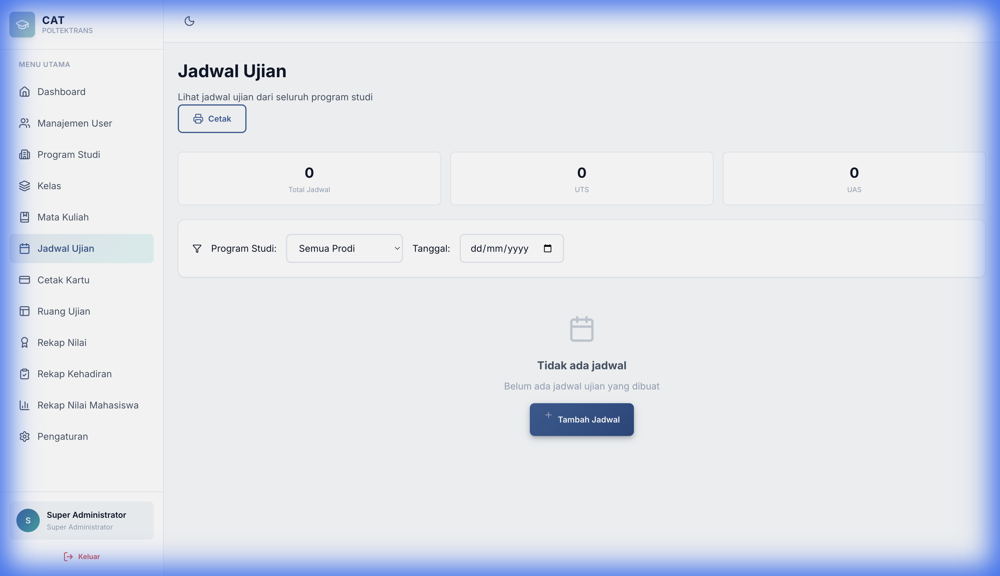

**Fitur:**
- Membuat jadwal ujian baru
- Menetapkan waktu mulai dan selesai
- Memilih ruangan ujian
- Menentukan dosen pengampu
- Menentukan pengawas ujian

### 3.4 Rekap Nilai

Melihat rekapitulasi nilai ujian seluruh mahasiswa.

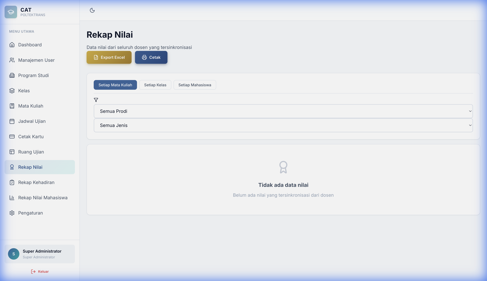

**Fitur:**
- Filter berdasarkan prodi, kelas, dan mata kuliah
- Export rekapitulasi ke Excel (.xlsx)
- Lihat detail nilai per mahasiswa

### 3.5 Rekap Kehadiran

Melihat rekapitulasi kehadiran ujian.

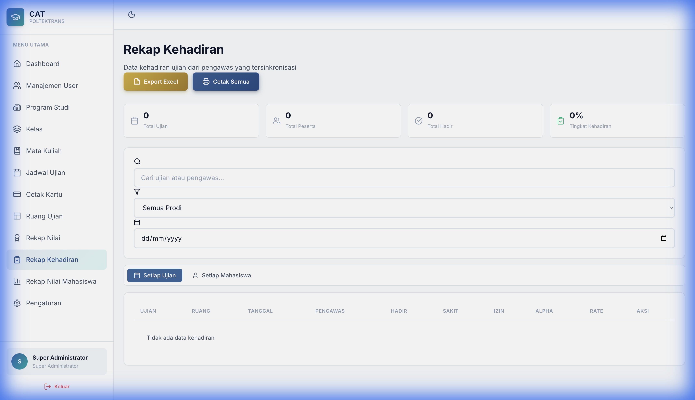

**Fitur:**
- Filter berdasarkan prodi dan jadwal ujian
- Statistik kehadiran (Hadir, Tidak Hadir)
- Export data kehadiran ke Excel

### 3.6 Pengaturan

Mengelola pengaturan sistem.

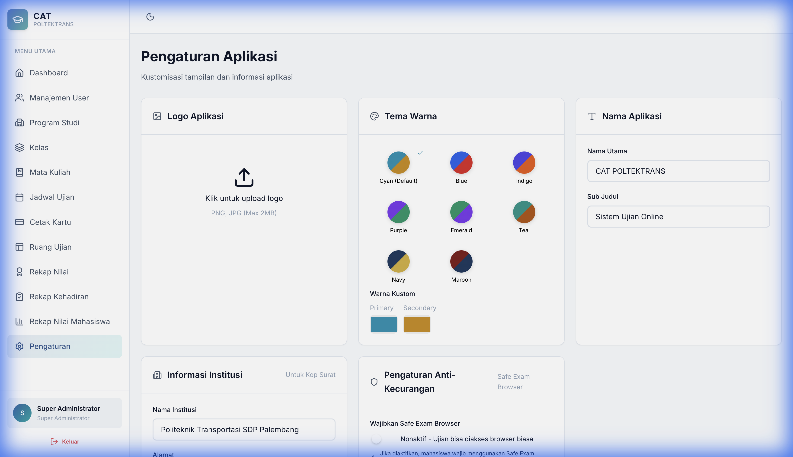

**Pengaturan yang tersedia:**
- **Safe Exam Browser (SEB)**: Konfigurasi integrasi SEB
- **Tahun Akademik**: Pengaturan tahun akademik aktif
- **Pengaturan Umum**: Nama institusi, logo, dan lainnya

---

## 4. Admin Prodi

Admin Prodi memiliki akses terbatas pada prodi yang ditentukan.

### 4.1 Dashboard

Dashboard menampilkan statistik khusus prodi.

**Fitur:**
- Statistik user per prodi
- Jadwal ujian prodi
- Ujian yang sedang berlangsung

### 4.2 Menu yang Tersedia

| Menu | Fungsi |
|------|--------|
| Dashboard | Ringkasan statistik prodi |
| Manajemen User | Kelola user dalam prodi |
| Prodi | Lihat informasi prodi |
| Kelas | Kelola kelas dalam prodi |
| Mata Kuliah | Kelola mata kuliah |
| Jadwal Ujian | Kelola jadwal ujian prodi |
| Ruang Ujian | Kelola ruang ujian |
| Rekap Nilai | Rekapitulasi nilai |
| Rekap Kehadiran | Rekapitulasi kehadiran |

---

## 5. Dosen

Dosen bertanggung jawab membuat soal dan mengoreksi ujian.

### 5.1 Dashboard

Dashboard menampilkan informasi terkait tugas mengajar.

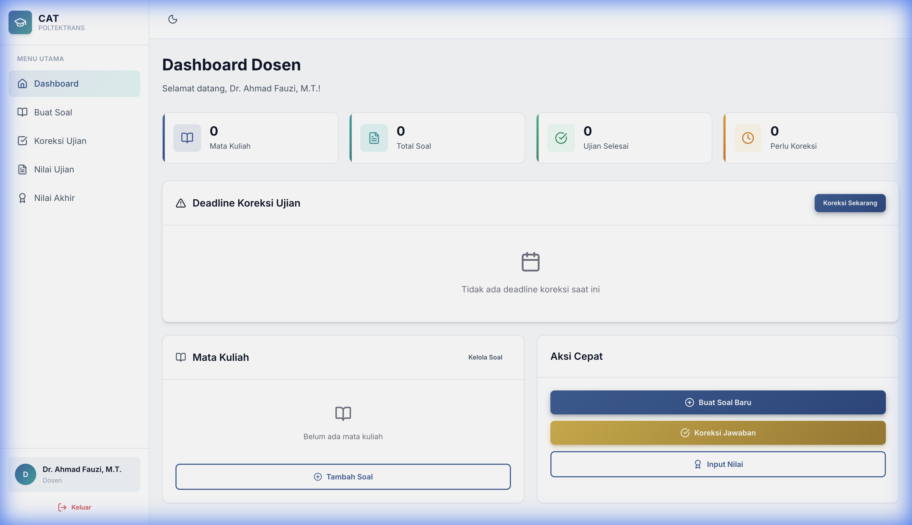

**Informasi yang ditampilkan:**
- Jadwal ujian yang diampu
- Status pembuatan soal
- Koreksi yang pending

### 5.2 Buat Soal (Bank Soal)

Menu untuk membuat dan mengelola soal ujian.

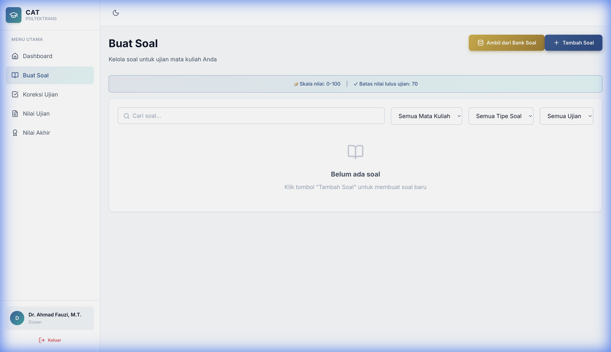

**Fitur:**
- Filter berdasarkan mata kuliah dan kelas
- Tambah soal baru dengan berbagai tipe:
  - Pilihan Ganda
  - Pilihan Ganda Kompleks
  - Benar/Salah
  - Menjodohkan
  - Uraian
- Edit dan hapus soal
- Import soal dari file

### 5.3 Koreksi Ujian

Menu untuk mengoreksi jawaban mahasiswa.

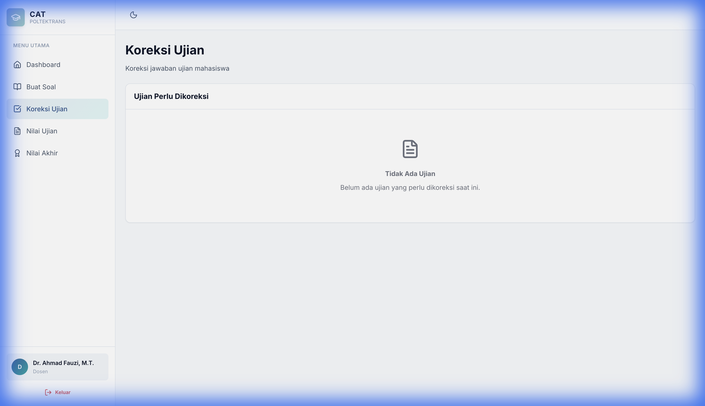

**Fitur:**
- Daftar ujian yang perlu dikoreksi
- Koreksi otomatis untuk soal objektif
- Input nilai manual untuk soal uraian

### 5.4 Nilai Akhir

Melihat dan mengelola nilai akhir mahasiswa.

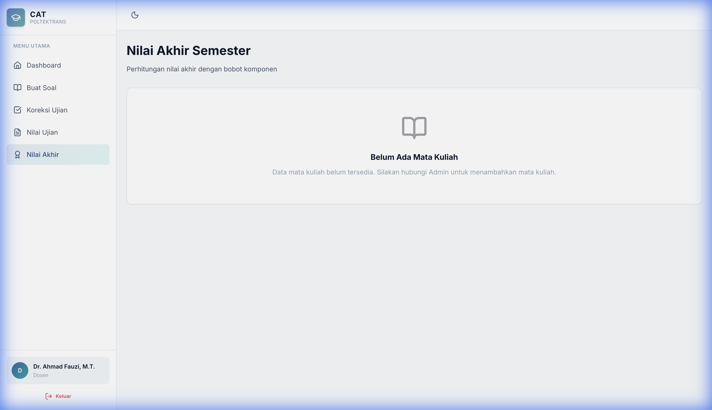

**Fitur:**
- Lihat nilai per mata kuliah
- Export nilai ke Excel (.xlsx)
- Filter berdasarkan kelas

---

## 6. Mahasiswa

Mahasiswa dapat mengikuti ujian dan melihat hasil.

### 6.1 Dashboard

Dashboard menampilkan informasi terkait ujian.

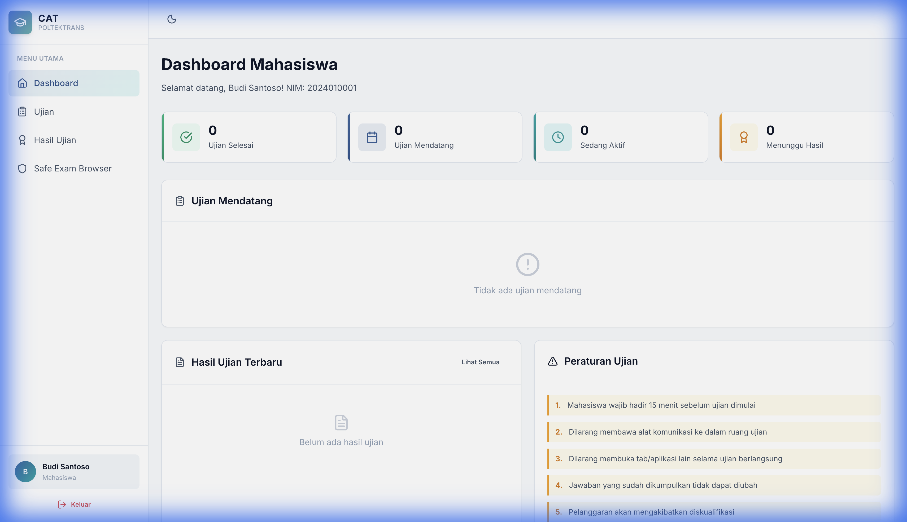

**Informasi yang ditampilkan:**
- Ujian yang tersedia
- Ujian yang telah diikuti
- Hasil ujian terbaru

### 6.2 Daftar Ujian

Melihat ujian yang tersedia untuk diikuti.

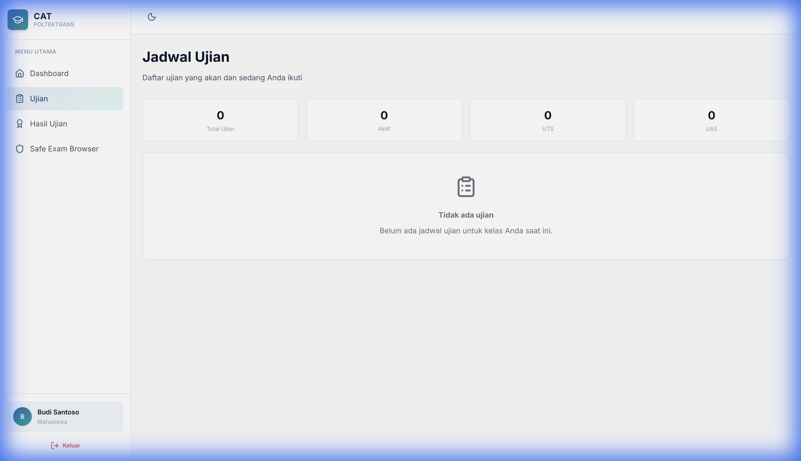

**Fitur:**
- Lihat jadwal ujian aktif
- Mulai ujian (saat waktu sudah dimulai)
- Informasi durasi dan jumlah soal

**Langkah Mengikuti Ujian:**
1. Lihat daftar ujian yang tersedia
2. Pastikan waktu ujian sudah dimulai
3. Klik "Mulai Ujian"
4. Baca instruksi ujian
5. Jawab soal satu per satu
6. Klik "Selesai" untuk submit jawaban

### 6.3 Hasil Ujian

Melihat hasil ujian yang telah diikuti.

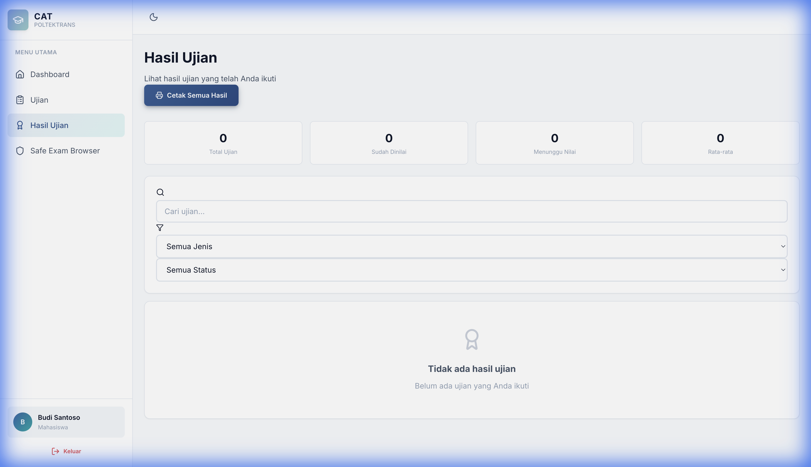

**Informasi yang ditampilkan:**
- Nilai per mata kuliah
- Tanggal ujian
- Status kelulusan

---

## 7. Pengawas

Pengawas bertugas memonitor ujian dan mencatat kehadiran.

### 7.1 Dashboard

Dashboard menampilkan informasi pengawasan.

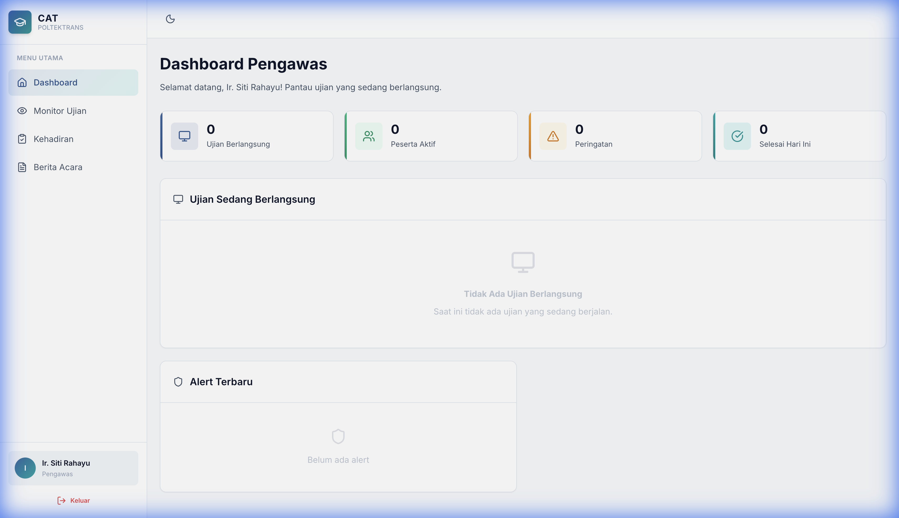

**Informasi yang ditampilkan:**
- Jadwal pengawasan hari ini
- Ujian yang sedang berlangsung
- Statistik kehadiran

### 7.2 Kehadiran

Mencatat kehadiran mahasiswa dalam ujian.

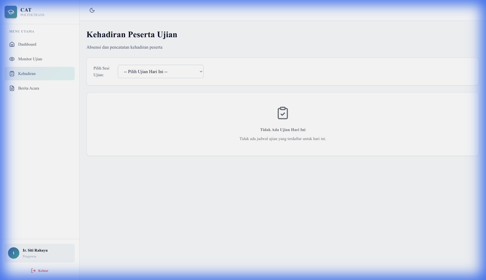

**Fitur:**
- Pilih jadwal ujian
- Lihat daftar mahasiswa
- Tandai kehadiran (Hadir/Tidak Hadir)
- Catat keterangan jika diperlukan

**Langkah Mencatat Kehadiran:**
1. Pilih jadwal ujian dari dropdown
2. Sistem akan menampilkan daftar mahasiswa
3. Klik pada status kehadiran untuk mengubah
4. Simpan perubahan

### 7.3 Monitor Ujian

Memonitor aktivitas mahasiswa selama ujian.

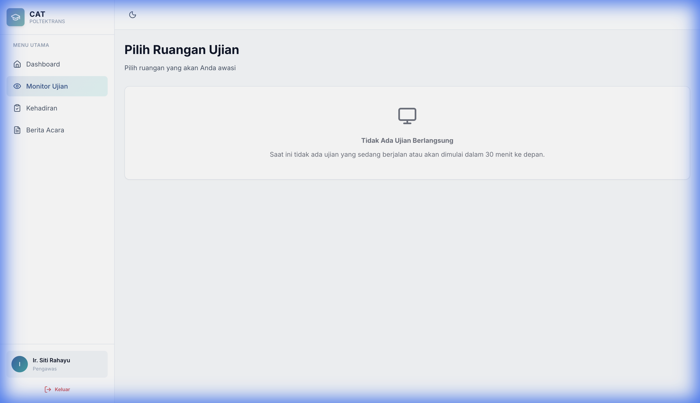

**Fitur:**
- Lihat mahasiswa yang sedang mengerjakan
- Monitor progres pengerjaan
- Lihat pelanggaran/alert

---

## 8. FAQ

### Q: Bagaimana jika lupa password?
**A:** Hubungi Admin Prodi atau Super Admin untuk reset password.

### Q: Bagaimana format file untuk import user?
**A:** Gunakan template import yang dapat diunduh dari menu Manajemen User. Format yang didukung adalah Excel (.xlsx).

### Q: Kenapa tidak bisa memulai ujian?
**A:** Pastikan:
1. Waktu ujian sudah dimulai
2. Anda terdaftar sebagai peserta ujian
3. Browser memenuhi persyaratan (jika menggunakan SEB)

### Q: Bagaimana cara melihat hasil ujian?
**A:** Masuk ke menu "Hasil Ujian" pada dashboard mahasiswa. Hasil akan ditampilkan jika dosen sudah selesai mengoreksi.

### Q: Apakah bisa mengerjakan ujian di HP?
**A:** Sistem dioptimalkan untuk desktop/laptop. Penggunaan HP mungkin memiliki keterbatasan tampilan.

### Q: Bagaimana jika terjadi error saat ujian?
**A:** Segera hubungi pengawas ujian. Jangan tutup browser sebelum mendapat konfirmasi dari pengawas.

---

## Kontak Support

Jika mengalami kendala, silakan hubungi:

- **Email**: support@polteknikstdp.ac.id
- **Telepon**: (0711) 123-4567
- **WhatsApp Admin**: +62 812-3456-7890

---

**© 2026 Politeknik Transportasi SDP Palembang. All rights reserved.**
